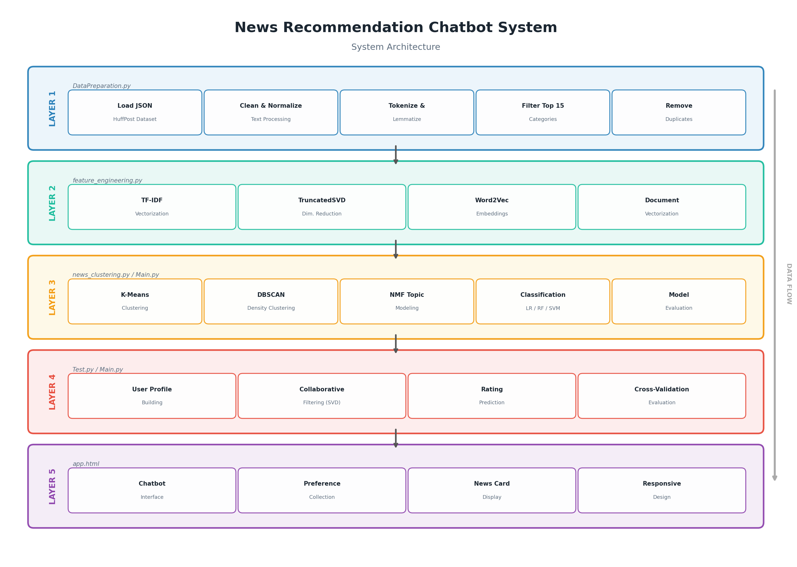

# News Recommendation Chatbot System

A comprehensive text analysis and recommendation system for news articles that combines clustering, classification, and collaborative filtering to provide personalized news recommendations through an interactive chatbot interface.

## Table of Contents

- [Overview](#overview)
- [System Architecture](#system-architecture)
- [Components](#components)
  - [Data Preparation](#data-preparation)
  - [Feature Engineering](#feature-engineering)
  - [News Clustering](#news-clustering)
  - [News Classification](#news-classification)
  - [Recommendation Engine](#recommendation-engine)
  - [Web Interface](#web-interface)
- [Installation](#installation)
- [Usage](#usage)
- [Technical Details](#technical-details)
- [Future Improvements](#future-improvements)

## Overview

This system processes news articles to understand their content, categorize them, identify similarities between articles, and recommend relevant news to users based on their preferences and reading history. It employs various machine learning techniques including natural language processing, unsupervised clustering, supervised classification, and collaborative filtering.

## System Architecture



The system consists of the following major components:

1. **Data Processing Pipeline**: Prepares and cleans news data
2. **Feature Engineering**: Converts text to numerical features
3. **Clustering Engine**: Groups similar news articles
4. **Classification Engine**: Categorizes news articles
5. **Recommendation Engine**: Suggests news to users
6. **Web Interface**: Interactive chatbot for user interaction

## Components

### Data Preparation

**File: `DataPreparation.py`**

This component handles the initial data loading, cleaning, and preprocessing:

- Loads JSON news data (headlines, descriptions, categories)
- Cleans and normalizes text (remove HTML, URLs, special characters)
- Handles missing values and duplicates
- Applies NLP techniques (tokenization, lemmatization, stopword removal)
- Filters to include only the top categories
- Generates analysis visualizations and statistics

```python
# Example usage
data_prep = NewsDataPreparation(input_file_path)
data_prep.load_data()
data_prep.filter_top_categories(n=15)
data_prep.clean_data()
data_prep.preprocess_text()
data_prep.standardize_format()
data_prep.save_processed_data()
```

### Feature Engineering

**File: `feature_engineering.py`**

Converts preprocessed text into numerical features for machine learning:

- TF-IDF vectorization to convert text to numerical features
- Dimensionality reduction using TruncatedSVD
- Alternative Word2Vec embeddings for semantic understanding
- Optional category one-hot encoding

The output includes:

- TF-IDF feature matrix
- Reduced SVD features
- Word2Vec document vectors
- Saved vectorizers and models for future use

### News Clustering

**File: `news_clustering.py`**

Identifies groups of similar news articles using unsupervised learning:

- K-Means clustering for clear group separation
- DBSCAN for density-based clustering
- Topic modeling using Non-negative Matrix Factorization (NMF)
- Silhouette score evaluation for optimal cluster count
- Cluster visualization using t-SNE
- Keyword extraction for each cluster
- Word cloud generation

```python
# Example usage
clustering = NewsClusteringModel(features_path, data_path, vectorizer_path)
best_k = clustering.evaluate_optimal_k(k_range=range(5, 21))
clustering.kmeans_clustering(n_clusters=best_k)
clustering.extract_cluster_keywords(cluster_column='kmeans_cluster')
clustering.visualize_clusters_tsne(cluster_column='kmeans_cluster')
```

### News Classification

**Files: `Test.py`, `Main.py`**

Categorizes news articles into predefined categories:

- Feature extraction using TF-IDF
- Multiple classification models:
  - Logistic Regression
  - Random Forest
  - Linear SVM
- Class imbalance handling with SMOTE
- Model evaluation with accuracy and classification reports
- Confusion matrix visualization

```python
# Example usage from Main.py
df = load_data(file_path, sample_size=50000)
df = preprocess_data(df)
X, vectorizer = extract_features(df)
models = train_classification_models(X, df['category_encoded'])
```

### Recommendation Engine

**Included in `Test.py` and `Main.py`**

Provides personalized news recommendations using:

- Collaborative filtering with Surprise SVD
- Simulated user preferences (for testing)
- Rating prediction
- Cross-validation for model evaluation

```python
# Example usage
recommender = train_recommender(df)
```

### Web Interface

**File: `app.html`**

An interactive chatbot interface for news recommendations:

- User-friendly chat interface
- Personalized recommendation display
- API integration with DeepSeek AI
- User profile creation and interest tracking
- Responsive design for various devices

## Installation

1. Clone the repository:

```
git clone https://github.com/yourusername/news-recommendation-system.git
cd news-recommendation-system
```

2. Install the required dependencies:

```
pip install -r requirements.txt
```

3. Prepare your dataset:
   - The system expects a JSON file with news articles containing at least the following fields:
     - headline
     - short_description
     - category

## Usage

### Data Processing and Model Training

1. Run the data preparation script:

```
python DataPreparation.py
```

2. Generate features:

```
python feature_engineering.py
```

3. Perform clustering analysis:

```
python news_clustering.py
```

4. Train classification and recommendation models:

```
python Main.py
```

### Web Interface

1. Open `app.html` in a web browser
2. Enter your DeepSeek API key when prompted
3. Interact with the chatbot by sharing your news interests
4. Receive personalized news recommendations

## Technical Details

### Libraries and Frameworks

- **Data Processing**: pandas, numpy
- **NLP**: NLTK, gensim
- **Machine Learning**: scikit-learn, Surprise
- **Visualization**: matplotlib, seaborn, wordcloud
- **Web Interface**: HTML, CSS, JavaScript

### Models

- **Clustering**: K-Means, DBSCAN, NMF
- **Classification**: Logistic Regression, Random Forest, Linear SVM
- **Recommendation**: SVD (Singular Value Decomposition)

### Data Flow

1. Raw JSON news data → Cleaned and processed text
2. Processed text → TF-IDF/Word2Vec features
3. Features → Clusters and categories
4. User interactions + Article metadata → Personalized recommendations

## Future Improvements

- Implement real-time news API integration
- Add user authentication and profile management
- Integrate with social media for improved recommendations
- Add sentiment analysis for emotion-aware recommendations
- Implement A/B testing framework for recommendation algorithms
- Add multi-language support
- Create mobile applications
